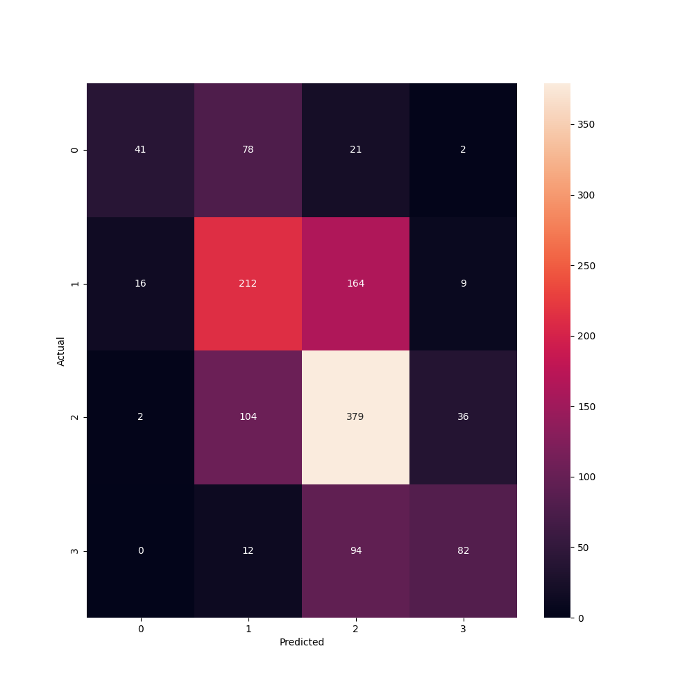

# Predicting the reviewer's assessment based on the content of the text using machine learning 

Text classification was performed including feature selection, tuning, classifier training and testing. 
The objects to be classified are the scale dataset v1.0 reviews provided in the link below: 
http://www.cs.cornell.edu/people/pabo/movie-review-data/ 

The purpose of review classification is to determine the assessment (positivity/negativity) of the text. 

The classification was performed using Naive Bayes algorithms: 
- Multinominal, 
- Gaussian, 
- Complementary, 
- Linear SVC, 
- Linear SVC with parameter search grid, 
- SVC. 

Visualization of the number of predictions (Linear SVC):

